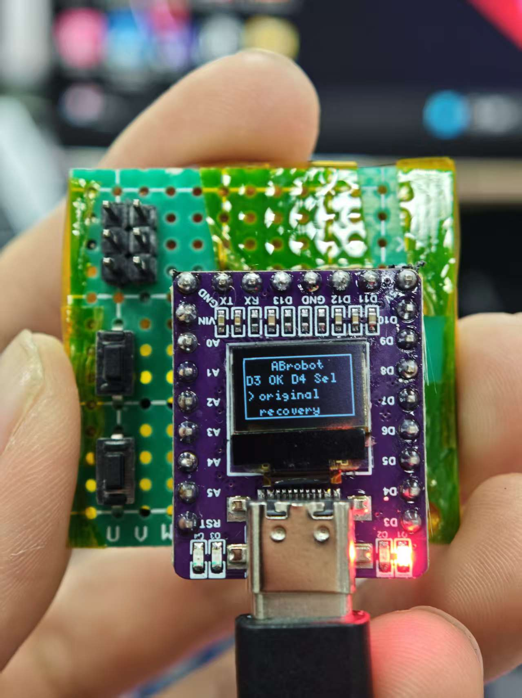
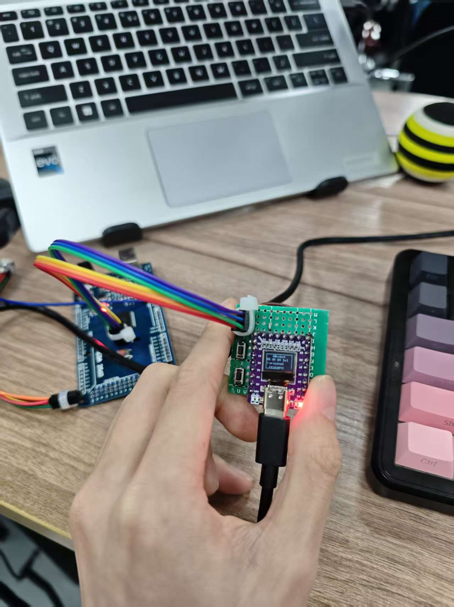
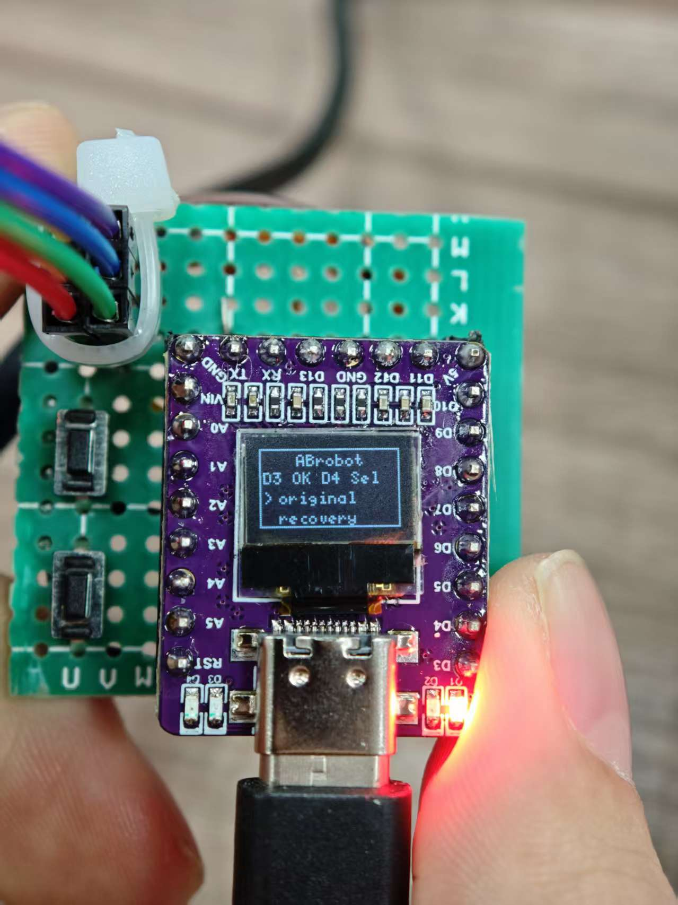

# Arduino Nano ISP（离线烧录器 / Bootloader A/B 选择 + OLED UI）

这是一个基于 **Arduino Nano (ATmega328P)** 的离线 ISP 烧录项目，用于给目标芯片（如 **ATmega2560**）烧录 bootloader。  
项目提供 **OLED 72×40 UI**（在 128×64 SSD1306 上裁剪显示）与 **按键选择 BootA/BootB**，烧录完成后显示结果并可返回 UI 重新选择。

---

## 预览图片

> Arduino Mini Oled（ABrobot店家）


<p align="center">
  
  
  
</p>

---

## 功能特性

- **离线 ISP 烧录**：无需电脑持续连接目标板（仅烧录器需要供电与可选串口日志）
- **A/B Bootloader 选择**：按键选择 BootA / BootB
- **OLED 状态显示**：显示选择界面、烧录中、成功/失败与提示
- **蜂鸣器静音版本**：bootloader v2 禁用板载蜂鸣器（更适合量产/安静环境）
- **结果页可返回 UI**：烧录完成后可按键返回，继续烧录下一块

---

## 硬件需求

- Arduino Nano (ATmega328P)
- SSD1306 OLED（128×64，I2C）
- 两个按键（建议：按下接 GND，使用 `INPUT_PULLUP`）
- ISP 连接线到目标芯片（MOSI/MISO/SCK/RESET/VCC/GND）
- 目标芯片示例：ATmega2560（签名 `1E 98 01`）

---

## 接线说明

### OLED（I2C）
- SDA → **A4**
- SCL → **A5**
- VCC → 3.3V/5V（按模块支持）
- GND → GND

> 推荐使用 **硬件 I2C (HW_I2C)** 以节省 Flash 空间、提高稳定性。

### 按键
- D3 → 按键 → GND（选择）
- D4 → 按键 → GND（确认）
- 使用内部上拉：`pinMode(D3, INPUT_PULLUP)` / `pinMode(D4, INPUT_PULLUP)`
- 逻辑：**按下 = LOW**

### ISP（示例：Arduino Nano 作为 ISP 主控）
> 以你工程内 `isp_config.h` / `isp_spi.h` 的定义为准。  
> 常见 ATmega ISP 连接：
- MOSI / MISO / SCK
- RESET（目标芯片复位脚）
- VCC / GND（目标供电与地必须共地）

---

## 文件说明

### `bootloader_image_original_v2.h`
- 官方 bootloader 的静音版本  
- 功能与原厂一致  
- **禁用了板载蜂鸣器**  
- 对应：**BootA**

### `bootloader_image_recovery_v2.h`
- 精简版 Recovery bootloader  
- 移除了调试和监控功能  
- 保留恢复与保护机制  
- **禁用了板载蜂鸣器**  
- 推荐用于量产和正式设备  
- 对应：**BootB**

---

## 命名规则

- `original`：官方 bootloader
- `recovery`：带恢复机制
- `_v2`：禁用蜂鸣器或移除调试功能的精简版本

---

## 使用方法（运行流程）

1. 上电后进入 **UI 选择界面**
   - D3：选择 BootA / BootB
   - D4：确认开始烧录
2. OLED 显示烧录状态（如 `PMODE`、`SIG`、`BURN`）
3. 烧录完成显示：
   - `OK DONE` 或 `FAIL CHECK`
4. 在结果页按 **D4** 可返回 UI，继续烧录下一块

---

## 编译与烧录（PlatformIO）

### 依赖库（示例）
在 `platformio.ini` 中加入：

```ini
lib_deps =
  olikraus/U8g2@^2.35.30
  ; 如果你用 OneButton：
  ; mathertel/OneButton@^2.5.0